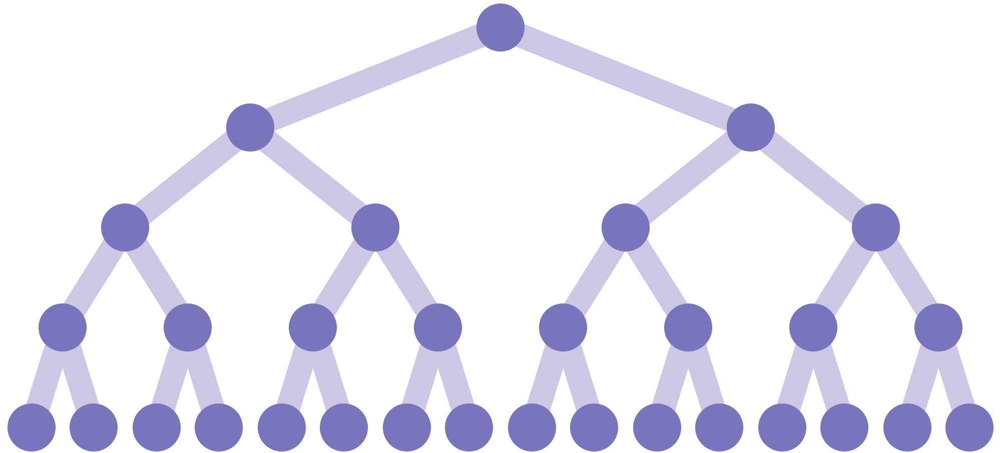
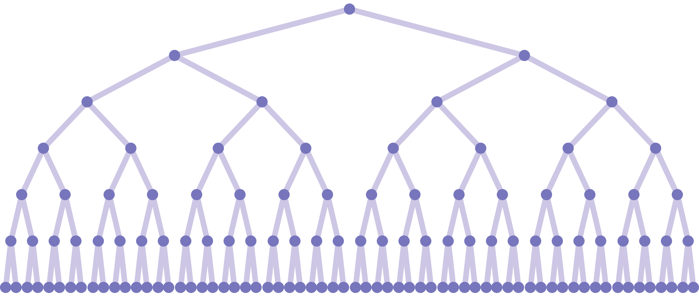

# Algorithms 1 - FRI

## Challenge 2

Few lines from complexity test, comparing runtimes of linear and binary search algorithms.
```
         n    linear    binary
    100000     19220      5681
    110000     12042      5193
    120000     11445       962
    130000     12854       359
    140000     13926       381
    150000     14901       402
    160000     15183       398
    170000     16608       398
    180000     17607       432
    190000     18607       427
    200000     19019       446
    210000     20047       507
```

## Challenge 3

Here are a few example renders of different trees from the third challenge.



